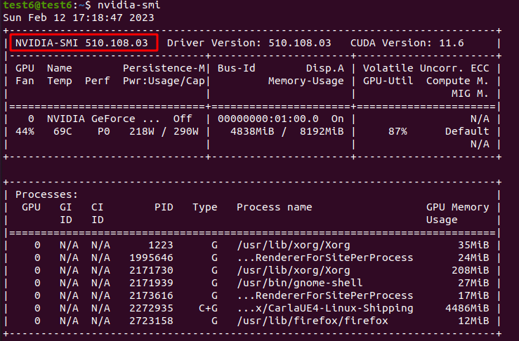
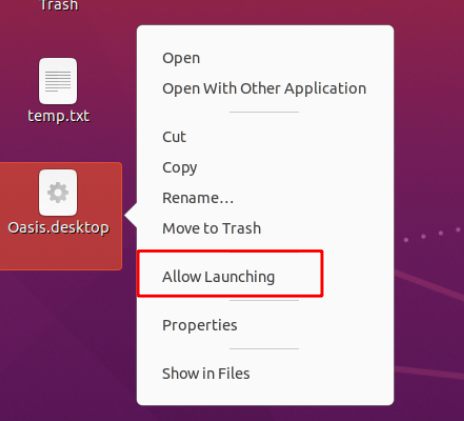
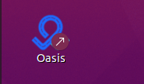
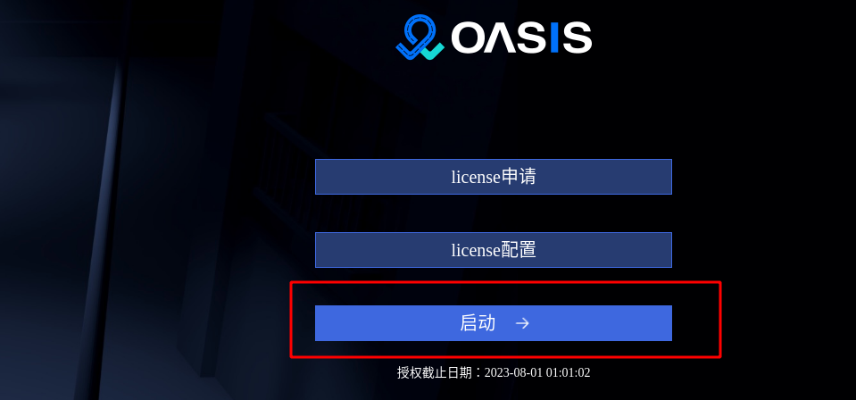

# 2. Installation and Deployment

## 2.1 Prerequisites
### 2.1.1 Operating System
The recommended operating system is Ubuntu 20.04.

### 2.1.2 Storage and Memory
- Hard disk: It is recommended to reserve more than 60GB of disk space.
- Memory: It is recommended to have a memory of no less than `16GB`.


### 2.1.3 Graphics Card Model
The recommended graphics card model is nvidia `3060` or above.


### 2.1.4 Graphics Card Driver Version
The recommended graphics card driver version is `510.108` or above, and the CUDA version is `11.4` or above.


### 2.1.5 Docker Version
The recommended Docker version is `20.10` or above.


### 2.1.6 Programming Language
It is recommended to use `Python 3.7` as the programming language.

## 2.2 Installation Steps
Before installation, make sure that the firewall is turned off. Use the command `sudo ufw status` to check the firewall status. By default, it is turned off.

```shell
sudo ufw status
Status: inactive
```
If it is in the `active` state, execute the following command to turn off the firewall.

```shell
sudo ufw disable
```
If the `ufw` command is not supported, execute the following command to install it first.

```shell
sudo apt install ufw
```

### 2.2.1 Download and Extract the Installation Package

```shell
wget https://carsmos.oss-cn-chengdu.aliyuncs.com/carsmos.tar.gz
tar -xzvf carsmos.tar.gz
```

Enter the `carsmos` folder, the directory structure is as follows:

├── oasis
│   ├── carla ·························· Oasis Carla module
│   ├── database ······················· Oasis Database module
│   ├── doc ···························· Installation instructions document
│   ├── install.sh ····················· Oasis installation script
│   ├── oasis-electron-linux ··········· Oasis Electron module
│   ├── oasis-web ······················ Oasis Web module
│   ├── public ························· Offline installation of docker/docker-compose/openssh-server
│   ├── service_module ················· Oasis service module
│   └── uninstall.sh ··················· Oasis uninstallation script
├── team_code
│   ├── dependencies ··················· Place dependencies and algorithm models here
│   └── dora-drives ···················· Develop programs here
└── upload.sh ·························· Script for uploading algorithms.

### 2.2.2 Run the Installation Script

Run the `install.sh` script.
```shell
./install.sh 
```
The installation process will last for about half an hour. Please be patient.

> Note: Installation cannot be performed through remote connection tools such as Xshell and PuTTY. The installation script needs to be executed on the local machine.


### 2.2.3 Add Icon Permissions

After installation, there will be an icon on the desktop. Right-click and select Allow to run.



The icon will change to the following:



## 2.3 Login and Use
### 2.3.1 Apply for and Configure license

Refer to：[License Import Instructions](en/license_en)

<!-- > Note：You need to apply for participation in the competition and pass the review on the [**Competition Registration System**](https://) before you can apply for a license. -->

<!-- 

按照如下流程申请


点击 `提交` 后， 并把 license 下载到本地。

## 3.2 配置 license

选择 license 配置后，选择上面步骤下载的  lincense。

 -->
### 2.3.2 Enter the Startup Page

Click the startup button to enter the Oasis Simulation Platform.



## 2.4 Uninstallation
Go to the Oasis directory and execute:
```shell
cd  carsmos/oasis
./uninstall.sh
```

<!-- ## 2.5 Product Description
Oasis Simulation Platform includes the following modules:

- Carla
- Database
- Services
- Web

Recommended system version configuration:

- Ubuntu 20.04
- NVIDIA 3060
- NVIDIA driver 510.108 -->

## 2.5 Installation Module Description
### 2.5.1 Carla
The component that executes simulation testing. This directory includes the necessary scripts and installation packages for Carla installation.
### 2.5.2 Database
Database and middleware components, including mysql, Redis, etcd, and influxdb:

- mysql stores the results of the entire simulation test;
- influxdb stores the test data required for chart display;
- Redis stores the process information of running tasks;
- etcd is used as the middleware for task scheduling;

This directory includes installation packages and installation scripts for all corresponding components.
### 2.5.3 Services
The service component includes 5 modules:

- oasis-simulate is responsible for interaction with the simulator, running test cases, and collecting results;
- oasis-viz is responsible for collecting and displaying sensor-related data during the scene running process;
- oasis-data is responsible for recording and replaying videos during the scene running process;
- oasis-task-manager is responsible for scheduling the entire test task and process control;
- oasis-server is the web server for the entire simulation testing platform, responsible for processing requests sent by the page;

This directory includes installation packages and installation scripts for all corresponding components.

### 2.5.4 Oasis-web
The interface display component is responsible for generating, issuing, and displaying the results of the task.
This directory includes installation packages and installation scripts for the corresponding components.

### 2.5.5 Oasis-electron-linux
The desktop shortcut component, double-click to open oasis-web.

### 2.5.6 Public
The public component includes installation packages and installation scripts for docker, nvidia-docker, docker-compose, and openssh.

## 2.6 Local Storage Directory Description

- /oasisdata/data: video replay, sensor-related data;
- /oasisdata/log: video replay, sensor-related logs;
- /oasisviz/data: test replay data;
- /oasisviz/log: test replay module logs;
- /opt/db_data/etcd: middleware etcd storage path;
- /opt/db_data/influx: database influx storage path;
- /opt/db_data/mysql: database mysql storage path;
- /opt/db_data/redis: database redis storage path;

