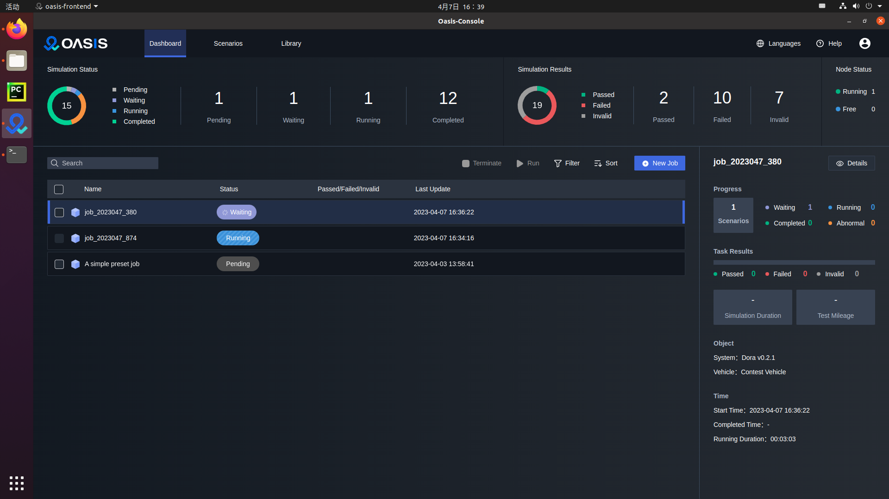
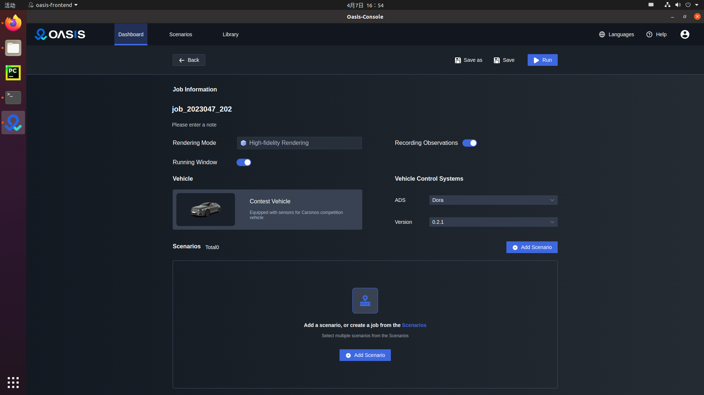
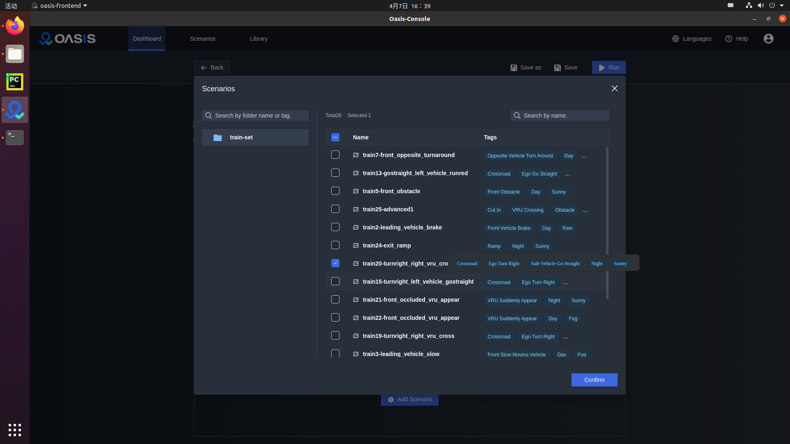
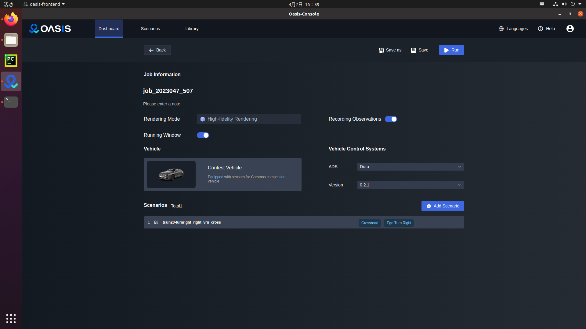
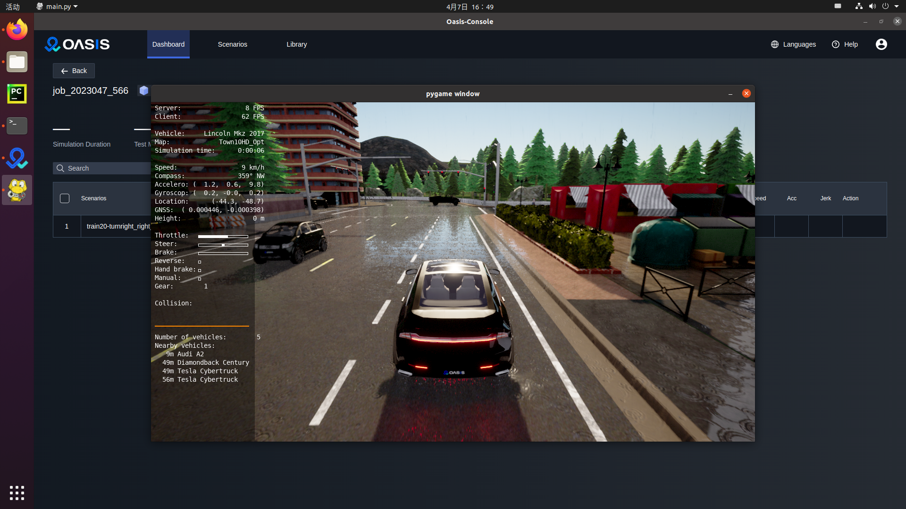
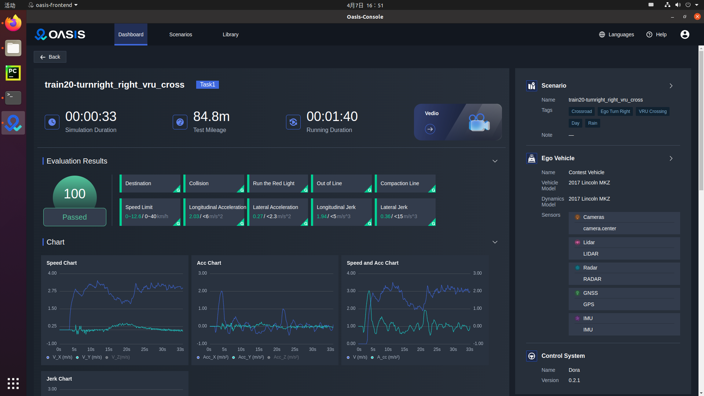
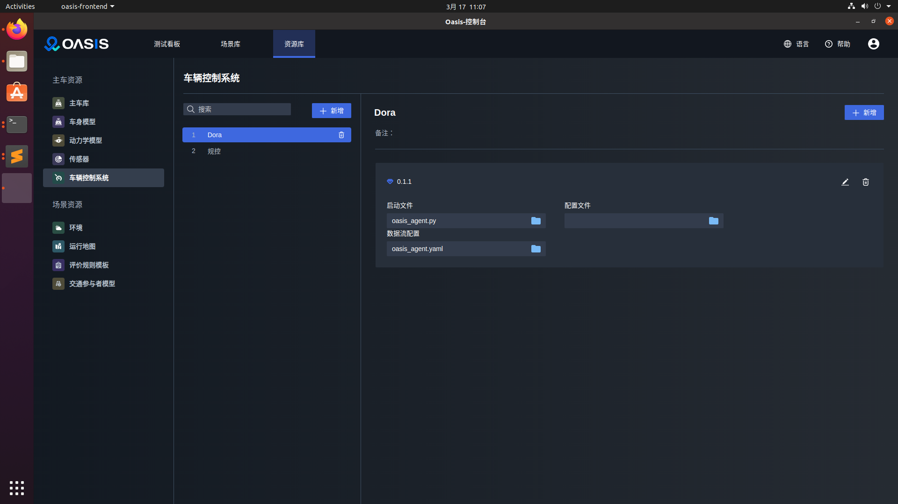

[Previous page:Install the deployment](en/install_en)

***
# 3 Development Guidelines

## 3.1 Running Example

- Access the Oasis Competition Edition directly through the desktop icon `Oasis`.

- Click on `Start` to enter the Oasis Competition Edition system.

  

- Click on `New Job`.

  

- You can choose whether to display the running window, whether to record, and the autonomous driving system and version. Then select the scene to add.

  

- Select several scenes and click `Confirm`.

  

- Click on `Run`, and the task will be added to the queue. Wait a moment and the running window will appear.

  

- After the run is finished, you can check the task running results, evaluation metrics, get sensor data, and view the task running video.

  

> After the simulation is complete, it is recommended to make a submission first. The first submission may take a longer time, but subsequent submissions will be faster. Please refer to [Submitting Algorithm](submit_en).

## 3.2 Developed based on Dora

### 3.2.1 About Dora

The goal of `dora` (Dataflow Oriented Robotic Architecture) is to provide low-latency, composable, and distributed dataflows.

`dora-drives` is a starter-kit based on `dora` for creating self-driving software. By breaking self-driving into several sub-problems such as
perception, mapping, planning, and control, we hope to make self-driving software accessible to all.

`dora-drives` hopes to solve self-driving as a community and we invite anyone to try to solve self-driving with us.

For this competition, we will be using Dora for development. For more information, please refer to:

- [**Dora-drives**](https://github.com/dora-rs/dora-drives)

- [**Dora-drives文档**](https://dora.carsmos.ai/dora-drives)

### 3.2.2 Development overview

As shown in [Training and Testing Algorithms](http://172.16.19.250:9001/start.md#_33-training-and-testing-algorithms), the main components that need to be developed include:

`my_operator.py`: (required) Operator that wraps the algorithm. `dora-drives` provides several operators for use, as detailed below. You can implement your own operator to implement your algorithm.

- `GPS operator`: Inputs opendrive map, main vehicle coordinates, and destination, and calculates and outputs gps waypoints. Path: `carsmos/team_code/dora-drives/carla/carla_gps_op.py`
- `Yolov5 operator`: Inputs real-time images and uses the yolov5 algorithm model to calculate and output bounding boxes. Path: `carsmos/team_code/dora-drives/operators/yolov5_op.py`
- `Obstacle location operator`: Inputs main vehicle coordinates, bounding boxes, and point cloud generated by lidar, and calculates and outputs obstacle information. Path: `carsmos/team_code/dora-drives/operators/obstacle_location_op.py`
- `FOT operator`: Inputs main vehicle coordinates, speed, obstacle information, and gps waypoints, and calculates and outputs real waypoints. For example, if a vehicle blocks the route ahead, this operator can calculate a route around the vehicle. Path: `carsmos/team_code/dora-drives/operators/fot_op.py`
- `PID Control operator`: Inputs main vehicle coordinates, speed, and the route points calculated by the `FOT operator`, and calculates and outputs control information for the main vehicle (throttle, direction, brake). Path: `carsmos/team_code/dora-drives/operators/pid_control_op.py`

`my_agent.py`: (required) Startup file, can be directly modified and used with the default `carsmos/team_code/dora-drives/carla/oasis_agent.py`.

`my_data_flow.yaml`: (required) Data flow file, can be directly modified and used with the default `carsmos/team_code/dora-drives/graphs/oasis/oasis_agent.yaml`.

`my_agent_config`: (optional) Configuration file.

> The above file names can be customized and developed in the `carsmos/team_code` directory.

### 3.2.3 Create an agent

Participants need to create **my_agent.py** as the startup file in the **team_code/dora-drives/carla** directory specified in the Oasis Competition Version to execute the autonomous driving algorithm, and can refer to the example **oasis_agent.py**.

The **my_agent.py** created by participants needs to be developed by inheriting the **AutonomousAgent** class, and the **AutonomousAgent** class can be found in **autoagents/autonomous_agent.py**. This class defines all the methods that need to be implemented, which need to be implemented in **my_agent.py** to access the autonomous driving algorithm module.

The competition system will use the algorithm to run multiple preset scenes in sequence, generate task results, and evaluate the participant's autonomous driving algorithm.

```python
from autoagents.autonomous_agent import AutonomousAgent

class YourAgent(AutonomousAgent):
    def __init__(self, debug=False):
```

### 3.2.4 Initialize the configuration  *setup*

Participants need to override the *setup* method in **my_agent.py**. This method performs all the initialization required by the *agent* before the scene task is run and is automatically called each time a new scene is loaded.

If you need to initialize the configuration through a *configuration file*, you need to create a configuration file in the **team_code/dora-drives/carla** directory specified in the Oasis Competition Version. The absolute path of the configuration file will be passed to the *setup* method through *path_to_conf_files*. Otherwise, please ignore.

At the same time, if necessary, you can load the latitude and longitude reference attributes into the *setup* method. These two attributes are reference values for converting *waypoint* coordinates to *carla* coordinates and will be updated before the *setup* runs.

```python
#latitude and longitude reference
lat_ref = None
lon_ref = None
class YourAgent(AutonomousAgent):
    def __init__(self, debug=False):
``````
    def setup(self, destination, path_to_conf_file):
        """
        Setup the agent parameters
        """
        global lat_ref, lon_ref
        lat_ref = self.lat_ref
        lon_ref = self.lon_ref
        ........

```

You can refer to the following function `from_gps_to_world_coordinate` to convert GPS data to world coordinates:

​```python
def from_gps_to_world_coordinate(lat, lon):
    global lat_ref, lon_ref

    EARTH_RADIUS_EQUA = 6378137.0  # pylint: disable=invalid-name
    scale = math.cos(lat_ref * math.pi / 180.0)
    mx_initial = scale * lon_ref * math.pi * EARTH_RADIUS_EQUA / 180.0
    my_initial = (
        scale
        * EARTH_RADIUS_EQUA
        * math.log(math.tan((90.0 + lat_ref) * math.pi / 360.0))
    )

    mx = lon / 180.0 * (math.pi * EARTH_RADIUS_EQUA * scale)
    my = math.log(math.tan((lat + 90.0) * math.pi / 360.0)) * (
        EARTH_RADIUS_EQUA * scale
    )
    x = mx - mx_initial
    y = -(my - my_initial)

    return [x, y]

```

### 3.2.5 Setting Up Sensors

Participants must rewrite the code to set up the  sensors Method，This method defines all the sensors that the agent can use.

In the Oasis Competition Version，Sensors can be directly configured in the Oasis Competition Version system's resource library to debug the optimal sensor configuration suitable for the participant's algorithm. **When submitting to the cloud for the competition, you need to write the optimal sensor configuration into the sensors method in my_agent.py and submit it. An example is as follows**

```python
def sensors(self):
        """Define the sensor suite required by the agent"""
        sensors = [
                {'type': 'sensor.camera.rgb', 'x': 0.7, 'y': 0.0, 'z': 1.60, 'roll': 0.0, 'pitch': 0.0, 'yaw': 0.0,
                'width': 800, 'height': 600, 'fov': 100, 'id': 'Center'},
                {'type': 'sensor.lidar.ray_cast', 'x': 0.7, 'y': -0.4, 'z': 1.60, 'roll': 0.0, 'pitch': 0.0,
                'yaw': -45.0, 'id': 'LIDAR'},
                {"type": "sensor.speedometer", "id": "Speed"},
                {'type': 'sensor.opendrive_map', 'reading_frequency': 1, 'id': 'OpenDRIVE'},
                {'type': 'sensor.other.radar', 'x': 0.7, 'y': -0.4, 'z': 1.60, 'roll': 0.0, 'pitch': 0.0,
                'yaw': -45.0, 'id': 'RADAR1','horizontal_fov':30,'vertical_fov':30},
                {'type': 'sensor.other.gnss', 'x': 0.7, 'y': -0.4, 'z': 1.60, 'id': 'GPS'},
                {'type': 'sensor.other.imu', 'x': 0.7, 'y': -0.4, 'z': 1.60, 'roll': 0.0, 'pitch': 0.0,
                'yaw': -45.0, 'id': 'IMU'},
            ]
        return sensors
```

Each sensor is represented by a dictionary containing the following fields：

- `type`: The type of sensor to be added.

- `id`: The label that will be assigned to the sensor for later access.

- `attributes`: These attributes are related to the sensor, such as external factors and field of view.

Participants can set the intrinsic and extrinsic parameters (position and direction) of each sensor relative to the center coordinates of the vehicle. Please note that CARLA uses the left-handed coordinate system of UE4, that is: X-forward, Y-right, Z-up.

Sensor parameter configuration can refer to the example content in AutonomousAgent for configuration. At the same time, we have limited the types and number of sensors that can be configured. Please refer to the following content

| Sensors can be installed | The number of vehicles that can be carried |
| ------------------------ | ------------------------------------------ |
| sensor.camera.rgb        | 4                                          |
| sensor.other.radar       | 2                                          |
| sensor.other.gnss        | 1                                          |
| sensor.other.imu         | 1                                          |
| sensor.opendrive_map     | 1                                          |
| sensor.lidar.ray_cast    | 1                                          |
| sensor.speedometer       | 1                                          |

Sensors are explained as follows:

- [`sensor.camera.rgb`](https://carla.readthedocs.io/en/0.9.10/ref_sensors/#rgb-camera) - A regular camera that captures images.
- [`sensor.lidar.ray_cast`](https://carla.readthedocs.io/en/0.9.10/ref_sensors/#lidar-sensor) - Velodyne 64 lidar.
- [`sensor.other.radar`](https://carla.readthedocs.io/en/0.9.10/ref_sensors/#radar-sensor) - Remote radar (maximum distance of 100 meters).
- [`sensor.other.gnss`](https://carla.readthedocs.io/en/0.9.10/ref_sensors/#gnss-sensor) - GPS sensor that returns geographical location data.
- [`sensor.other.imu`](https://carla.readthedocs.io/en/0.9.10/ref_sensors/#imu-sensor) - Six-axis inertial measurement unit.
- `sensor.opendrive_map` - A pseudo sensor that parses a high-definition map in OpenDRIVE format into a string.
- `sensor.speedometer` - A pseudo sensor that provides an approximate value of linear speed.

> Trying to use other sensors or sensor parameter names incorrectly will cause sensor settings to fail.

> If an excessive number of sensors are used in the submission, the sensor configuration validation will fail and the program will crash.

In addition, there are some spatial restrictions that limit the position of the sensor inside the vehicle bounding box. If a sensor is more than 3 meters away from the main vehicle on any axis (for example: `[3.1,0.0,0.0]`), the setting will fail.

### 3.2.6 Override the run_step method

The *run_step* method will be called once per *world tick* and generates a new action in the form of a `carla.VehicleControl` object. Make sure to return the control object from this function, which will be used to update the simulation's ego vehicle.

Participants can develop their algorithm in the *run_step* method and must ensure that the function returns a `carla.VehicleControl` object, which will be used to control the movement of the simulation's ego vehicle.

```python
    def run_step(self, input_data, timestamp):
        """
        Execute one step of navigation.
        :return: control
        """
        # do something smart

        control = carla.VehicleControl()
        control.steer = 0.0
        control.throttle = 0.0
        control.brake = 0.0
        control.hand_brake = False

        return control

```

- `world.tick()`: Runs the simulation world for one time step. Currently, the simulation world runs at a frequency of 20Hz, with each time step being 0.05s

- `run_step()`: Called once per time step, receives the output information of the loaded sensors, processes it with the algorithm, and outputs the vehicle's control information

- `input_data`: A dictionary that returns the output data of the loaded sensors in numpy array format at each *world tick*. This dictionary is indexed by the ID defined in the sensor method.

- `Timestamp`: The current simulation world time frame number.

### 3.2.7 Override the destroy method

At the end of each scene task, the `destroy` method will be called, and participants need to override the `destroy` method to end the corresponding processes or threads.

```python
def destroy(self):
    # destroy process 
    pass
```

### 3.2.8 Create a processing node（`operator`）

It is recommended to package the algorithm as a processing node (`operator`) and create a Python file such as `my_operator.py`.

As an example, we can add the YOLOv5 object detection processing node, which is already implemented in *dora-drives/operators/yolov5_op.py*.

```python
import os
from typing import Callable

import cv2
import numpy as np
import torch
from dora import DoraStatus

DEVICE = os.environ.get("PYTORCH_DEVICE") or "cpu"

class Operator:
    """
    Infering object from images
    """

    def __init__(self):
        self.model = torch.hub.load(
            "ultralytics/yolov5",
            "yolov5n",
        )
        self.model.to(torch.device(DEVICE))
        self.model.eval()

    def on_input(
        self,
        dora_input: dict,
        send_output: Callable[[str, bytes], None],
    ) -> DoraStatus:
        """Handle image
        Args:
            dora_input["id"](str): Id of the input declared in the yaml configuration
            dora_input["data"] (bytes): Bytes message of the input
            send_output (Callable[[str, bytes]]): Function enabling sending output back to dora.
        """

        frame = cv2.imdecode(
            np.frombuffer(
                dora_input["data"],
                dtype="uint8",
            ),
            -1,
        )
        frame = frame[:, :, :3]

        results = self.model(frame)  # includes NMS
        arrays = np.array(results.xyxy[0].cpu())[
            :, [0, 2, 1, 3, 4, 5]
        ]  # xyxy -> xxyy
        arrays[:, 4] *= 100
        arrays = arrays.astype(np.int32)
        arrays = arrays.tobytes()
        send_output("bbox", arrays, dora_input["metadata"])
        return DoraStatus.CONTINUE
```

To add the YOLOv5 object detection processing node as an operator, you need to override the `__init__` and `on_input` methods.

The `__init__` method is called when the processing node is initialized, and is used to perform all the initialization and definition required by the processing node.

The `on_input` method is called once per time step.

Participants need to define the input `inputs` and output `outputs` in the configuration data stream's YAML file.

If successful, return the CONTINUE flag;

### 3.2.9 Create a dataflow

Dora needs to start each node through the data stream file to complete the operation and startup of perception, localization, planning, control, and other `operators`.

You can modify the contents of `oasis_agent.yaml` to include `my_operator.py` as a node, or you can create a new data stream file `my_data_flow.yaml`.

If you want to run the algorithm processing node, you just need to add them to the node graph:

```yaml
communication:
  iceoryx:
    app_name_prefix: dora-iceoryx-example

nodes:
  - id: my_algorithm
    operator:
      python: my_operator.py
      outputs:
        ...
      inputs:
        ...

  # 以下为示例

  - id: webcam
    operator:
      python: ../../operators/webcam_op.py
      inputs:
        tick: dora/timer/millis/100
      outputs:
        - image

  - id: yolov5
    operator: 
      outputs:
        - bbox
      inputs:
        image: webcam/image
      python: ../../operators/yolov5_op.py

  - id: plot
    operator:
      python: ../../operators/plot.py
      inputs:
        image: webcam/image
        obstacles_bbox: yolov5/bbox
        tick: dora/timer/millis/100
```

- `nodes`: The group of nodes to be run.
- `id`: The ID of the node.
- `python`: The code file to be run.
- `inputs`: The input of the current node.
- `outputs`: The output of the current node.

The inputs are prefixed with the node name to avoid naming conflicts.

The data stream is defined through a `.yaml` file, see **team_code/dora-drives/graphs/oasis/oasis_agent.yaml** for reference.

You can use the following command in the Docker container to run the algorithm:

```bash
./scripts/launch.sh -b -g tutorials/webcam_yolov5.yaml
```
> For more detailed information about Dora, please refer to:[**Dora documentation**](https://dora-rs.github.io/dora-drives/introduction.html)

## 3.3 Train and test algorithms

- In `Oasis Competition Edition - Resource Library - Vehicle Control System - Dora`, replace *oasis_agent.py* with *my_agent.py* and replace *oasis_agent.yaml* with *my_data_flow.yaml*. If there is a configuration file, please select it, otherwise you can ignore it.

  

- A set of predefined scenarios are available in the Oasis Competition Edition, which can be used to train and validate algorithms.

- The scenarios can be found in the *Oasis Competition Edition - Scenario Library*. Please refer to [Scenario Description](http://172.16.19.250:9001/scenarios.md) for specific scenario descriptions.

## 3.4 On Dora-drives Source Code Management (SCM)

### 3.4.1 How to Contribute

To set up git:
- Git fork the project. Go to: [dora-drives/fork](https://github.com/dora-rs/dora-drives/fork)

- Set the source code configuration in your `dora-drives` folder:

```bash
# cd dora-drives
git remote rm origin
git remote add dora https://github.com/dora-rs/dora-drives.git
git remote add origin https://github.com/<USERNAME>/dora-drives.git 
```

- In case you want to fetch updates from `dora-drives`:

```bash
git fetch dora
git checkout main
git rebase dora/main
```

- You can push your changes to dora-drives` by creating a Pull Request:
```bash
git checkout -b my_branch # Create a new branch
git add `...changes...` # Add your changes
git commit -m "message"
git push --set-upstream origin my_branch
# go to: https://github.com/dora-rs/dora-drives/compare/main...<USERNAME>:dora-drives:<my_branch>
```

- We are greatful for any kind of contribution. We know that `dora-drives` still has many issues and we're sorry. But,
we hope that step-by-step, commit-by-commit, we can make it a great open source self-driving starter kit.

### 3.4.2 On Issues 

- If you have any issue using `dora-drives`, please raise an issue on our github page: https://github.com/dora-rs/dora-drives/issues
- You can also reach out to discuss `dora-drives` in the discussion section: https://github.com/dora-rs/dora-drives/discussions

***

[Previous page:Development Guidelines](en/install_en)

[Next page:Competition Rules](en/rules_en)