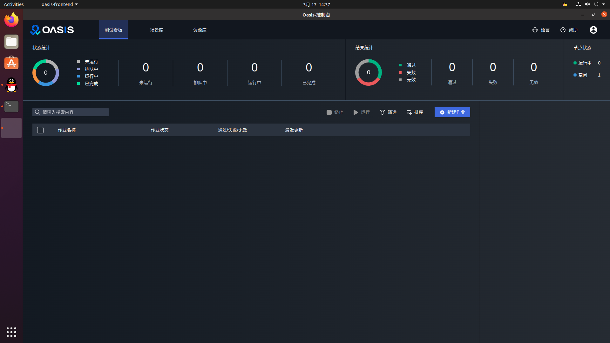
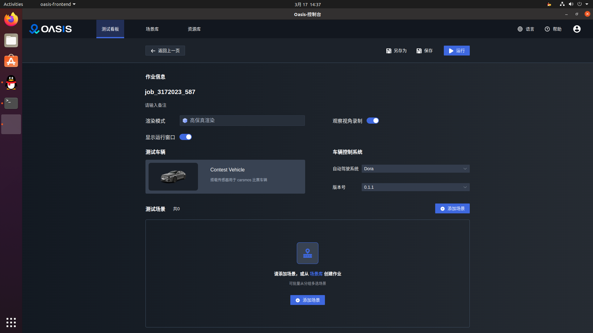
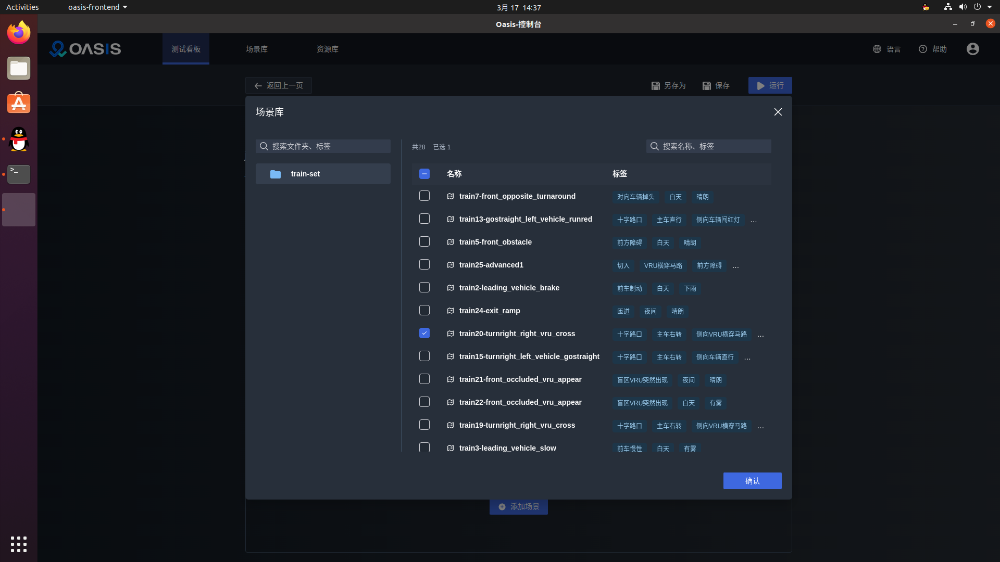
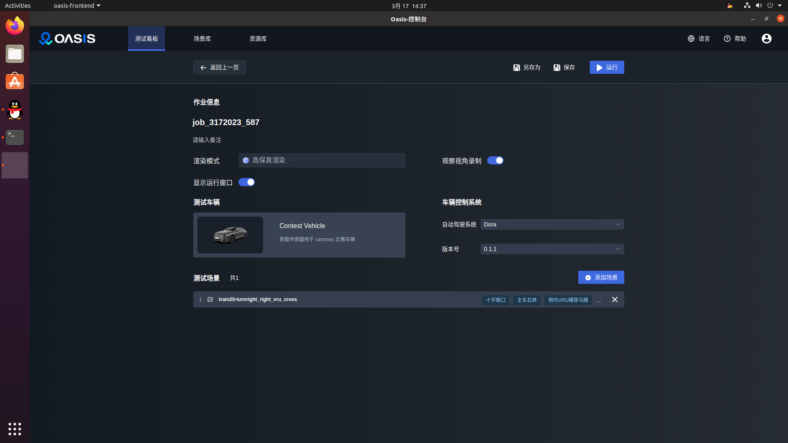
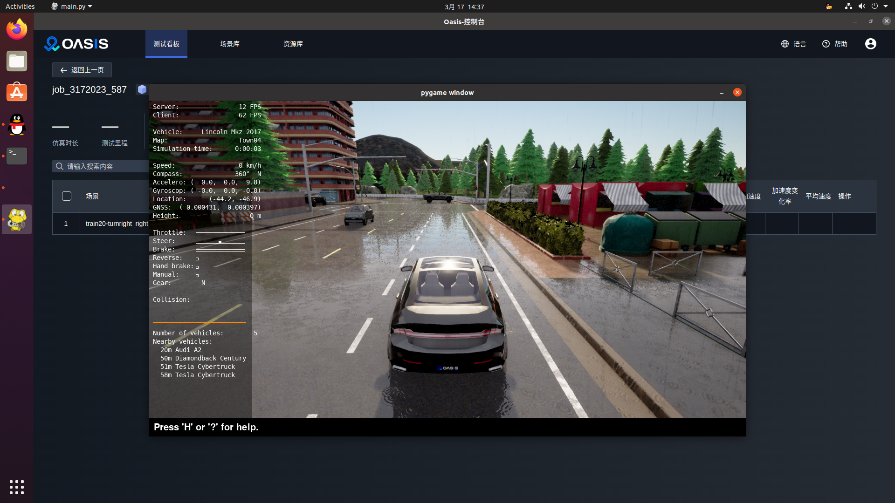
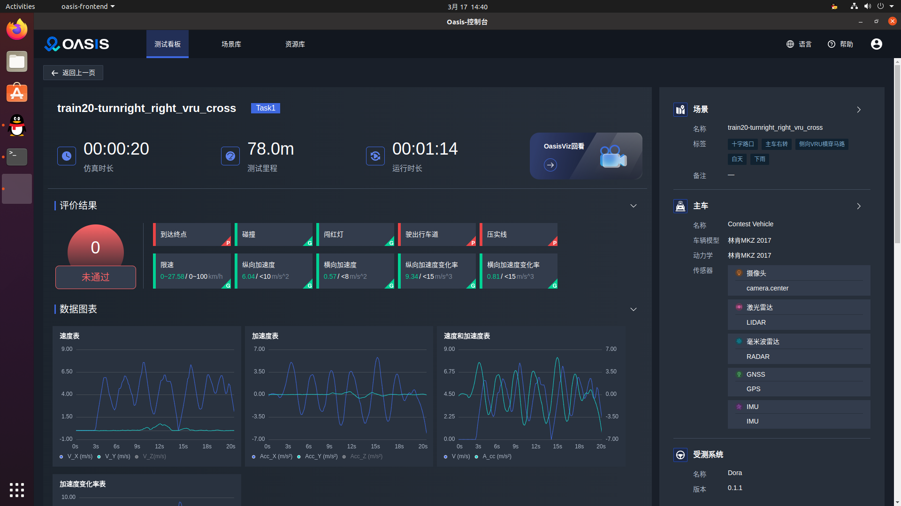

[上一页：安装部署](install.md)

***
# 3 开发指引

## 3.1 运行示例

- 直接通过桌面图标 `Oasis` 进入 `Oasis` 竞赛版

- 点击 `启动` 进入 `Oasis` 竞赛版系统

  

- 点击新建作业

  

- 可选择是否显示运行窗口、是否录制，以及自动驾驶系统和版本。然后选择添加场景
  
  

- 选择若干个场景，点击确认

  

- 点击 `运行` ，任务加入队列，稍等就会出现运行窗口

  

- 运行结束，可查看任务运行结果，评价指标，获取传感器数据，查看任务运行视频

  

> 运行完第一次后，建议先进行一次提交。第一次提交会花费较多时间，后续提交则会很快，参考：[提交算法](submit.md)

## 3.2 基于 dora-drives 开发

### 3.2.1 dora-drives 简介

`dora`（Dataflow Oriented Robotic Architecture）的目标是提供低延迟、可组合、分布式的数据流（`data-flow`）。

`dora-drives` 是一款基于 `dora` 的自动驾驶软件入门套件。通过将自动驾驶分解为`感知`、`映射`、`规划`和`控制`等几个子问题，我们希望让所有人都能使用自动驾驶软件。`dora-drives` 希望构建一个自动驾驶社区，我们邀请任何人与我们一起尝试解决自动驾驶问题。

本次比赛使用 `dora-drives` 进行开发，详情请参考：

- [**dora-drives**](https://github.com/dora-rs/dora-drives)

- [**dora-drives文档**](https://dora.carsmos.ai/dora-drives)

### 3.2.2 开发概述

如[训练和测试算法](start.md#_33-训练和测试算法)所示，需要开发的内容主要包括：

`my_operator.py`：（必选）包装算法的算子（`operators`）。`dora-drives` 提供了若干个 `operator` 以供使用，详情如下。您可以实现自己的 `operator`，用于实现您的算法。

  - `GPS operator`：输入 opendrive 地图、主车坐标及目的地，可计算并输出 gps 路点。路径：`carsmos/team_code/dora-drives/carla/carla_gps_op.py`
  - `Yolov5 operator`：输入实时图片，可利用 yolo 算法模型计算并输出 bounding boxes。路径：`carsmos/team_code/dora-drives/operators/yolov5_op.py`
  - `Obstacle location operator`：输入主车坐标、bounding boxes以及激光雷达产生的 point cloud，可计算并输出障碍物的信息。路径：`carsmos/team_code/dora-drives/operators/obstacle_location_op.py`
  - `FOT operator`：输入主车坐标、速度、障碍物信息以及 gps 路点，可计算并输出真实的路点。比如前方有车挡住路线，这个 `operator` 可以计算出绕过前方车辆的路线。路径：`carsmos/team_code/dora-drives/operators/fot_op.py`
  - `PID Control operator`：输入主车坐标、速度及 `FOT operator` 计算出的路点，可计算并输出对主车的控制信息（油门、方向、刹车）。路径：`carsmos/team_code/dora-drives/operators/pid_control_op.py`

`my_agent.py`：（可选）启动文件，可直接修改 `oasis` 提供的 `carsmos/team_code/dora-drives/carla/oasis_agent.py`。

`my_data_flow.yaml`：（可选）数据流文件，可直接修改 `oasis` 提供的 `carsmos/team_code/dora-drives/graphs/oasis/oasis_agent.yaml`。

`my_agent_config`：（可选）配置文件。

> 以上文件名都可以自定义，需要在 `carsmos/team_code` 目录下进行开发。

### 3.2.3 创建 Agent

在 **carsmos/team_code/dora-drives/carla** 目录下，创建 **my_agent.py** 作为启动文件（文件名可自定义），用于执行自动驾驶算法，可参考同目录下的示例 **oasis_agent.py** 。

参赛选手所创建的 **my_agent.py** 需要通过继承 **AutonomousAgent** 类进行开发，可以在 **autoagents/autonomous_agent.py** 中找到 **AutonomousAgent** 类，这里定义了所有需要实现的方法，需要在 **my_agent.py** 中实现来接入自动驾驶算法模块。

比赛系统将会使用算法依次运行多个预置的场景，生成任务结果，评估参赛选手的自动驾驶算法。

```python
from autoagents.autonomous_agent import AutonomousAgent

class YourAgent(AutonomousAgent):
    def __init__(self, debug=False):
```

### 3.2.4 初始化配置 *setup*

参赛选手需要在 **my_agent.py** 中重写 *setup* 方法，此方法会在场景任务运行之前，执行 *agent* 所需要的所有初始化，它将在每次加载新的场景时被自动调用。

如果需要通过 *配置文件* 的方式来初始化配置，需要在 **carsmos/team_code/dora-drives/carla** 目录下创建配置文件，该配置文件的绝对路径会通过 *path_to_conf_files* 传入 *setup* 方法。否则请忽略。

同时，如果需要，可以将经纬度参考属性加载到 *setup* 方法中，它们会在 *setup* 运行之前就被更新，这两个属性是将 *waypoint* 坐标转换成 *carla* 坐标的参考值。

```python
#latitude and longitude reference
lat_ref = None
lon_ref = None
class YourAgent(AutonomousAgent):
    def __init__(self, debug=False):
		``````
    def setup(self, destination, path_to_conf_file):
        """
        Setup the agent parameters
        """
        global lat_ref, lon_ref
        lat_ref = self.lat_ref
        lon_ref = self.lon_ref
        ........

```

可以参考以下函数 `from_gps_to_world_coordinate` 将 gps 数据转换为世界坐标：

```python
def from_gps_to_world_coordinate(lat, lon):
    global lat_ref, lon_ref

    EARTH_RADIUS_EQUA = 6378137.0  # pylint: disable=invalid-name
    scale = math.cos(lat_ref * math.pi / 180.0)
    mx_initial = scale * lon_ref * math.pi * EARTH_RADIUS_EQUA / 180.0
    my_initial = (
        scale
        * EARTH_RADIUS_EQUA
        * math.log(math.tan((90.0 + lat_ref) * math.pi / 360.0))
    )

    mx = lon / 180.0 * (math.pi * EARTH_RADIUS_EQUA * scale)
    my = math.log(math.tan((lat + 90.0) * math.pi / 360.0)) * (
        EARTH_RADIUS_EQUA * scale
    )
    x = mx - mx_initial
    y = -(my - my_initial)

    return [x, y]

```

### 3.2.5 设置传感器

参赛选手必须要重写 sensors 方法，该方法定义了 agent 能够使用的所有传感器。

在 Oasis 竞赛版中，传感器可直接在 Oasis 竞赛版系统 - 资源库中进行配置，以调试得到适合参赛选手算法的最优传感器配置，**在提交到云端参赛时，需要将最优的传感器配置写入 my_agent.py 中的 sensors 方法中，进行提交。示例如下**

```python
def sensors(self):
        """Define the sensor suite required by the agent"""
        sensors = [
                {'type': 'sensor.camera.rgb', 'x': 0.7, 'y': 0.0, 'z': 1.60, 'roll': 0.0, 'pitch': 0.0, 'yaw': 0.0,
                'width': 800, 'height': 600, 'fov': 100, 'id': 'Center'},
                {'type': 'sensor.lidar.ray_cast', 'x': 0.7, 'y': -0.4, 'z': 1.60, 'roll': 0.0, 'pitch': 0.0,
                'yaw': -45.0, 'id': 'LIDAR'},
                {"type": "sensor.speedometer", "id": "Speed"},
                {'type': 'sensor.opendrive_map', 'reading_frequency': 1, 'id': 'OpenDRIVE'},
                {'type': 'sensor.other.radar', 'x': 0.7, 'y': -0.4, 'z': 1.60, 'roll': 0.0, 'pitch': 0.0,
                'yaw': -45.0, 'id': 'RADAR1','horizontal_fov':30,'vertical_fov':30},
                {'type': 'sensor.other.gnss', 'x': 0.7, 'y': -0.4, 'z': 1.60, 'id': 'GPS'},
                {'type': 'sensor.other.imu', 'x': 0.7, 'y': -0.4, 'z': 1.60, 'roll': 0.0, 'pitch': 0.0,
                'yaw': -45.0, 'id': 'IMU'},
            ]
        return sensors
```

每个传感器由一个 dict 表示，包含以下字段：

- `type`：要添加的传感器的类型。

- `id`：将被赋予传感器的标签，以便以后访问。

- `attributes`：这些属性与传感器有关，例如：外在因素和视野等。
  
参赛选手可以设置每个传感器的内在参数和外在参数（位置和方向），以相对于车辆的中心坐标为准。请注意，CARLA 使用 UE4 的左手坐标系统，即：X-前，Y-右，Z-上。

传感器参数配置可以参考 AutonomousAgent 中的示例内容进行配置，同时我们对传感器的可选类型与可配置数量做了限制，请参考下述内容

| 可搭载传感器                | 可搭载数量 |
| --------------------- | ----- |
| sensor.camera.rgb     | 4     |
| sensor.other.radar    | 2     |
| sensor.other.gnss     | 1     |
| sensor.other.imu      | 1     |
| sensor.opendrive_map  | 1     |
| sensor.lidar.ray_cast | 1     |
| sensor.speedometer    | 1     |

传感器具体解释如下：

- [`sensor.camera.rgb`](https://carla.readthedocs.io/en/0.9.10/ref_sensors/#rgb-camera) - 捕捉图像的普通相机。

- [`sensor.lidar.ray_cast`](https://carla.readthedocs.io/en/0.9.10/ref_sensors/#lidar-sensor) - Velodyne 64 激光雷达。

- [`sensor.other.radar`](https://carla.readthedocs.io/en/0.9.10/ref_sensors/#radar-sensor) - 远程雷达（最远100米）。

- [`sensor.other.gnss`](https://carla.readthedocs.io/en/0.9.10/ref_sensors/#gnss-sensor) - 返回地理位置数据的GPS传感器。

- [`sensor.other.imu`](https://carla.readthedocs.io/en/0.9.10/ref_sensors/#imu-sensor) - 六轴惯性测量单元。

- `sensor.opendrive_map` - 伪传感器，以OpenDRIVE格式解析为字符串的高清地图。

- `sensor.speedometer` - 伪传感器，提供线性速度的近似值。

> 如果尝试使用其他传感器或传感器参数名称错误，会使传感器设置失败。

> 如果在提交中使用了超量的传感器，传感器配置验证失败，运行会出错。

此外，还有一些空间限制，限制了传感器在车辆包围盒内的位置。如果一个传感器在任何轴线上与主车相距超过3米（例如：`[3.1,0.0,0.0]`），设置将失败。

### 3.2.6 重写 run_step 方法

这个方法将在每个 *world tick* 被调用一次，产生一个新的动作，其形式为 `carla.VehicleControl` 对象。确保该函数返回控制对象，该对象将被用于更新仿真主车。

参赛选手可以在 *run_step* 中开发算法，并必须确保函数返回的是 `carla.VehicleControl` 对象，该返回对象将用于控制仿真主车运动。

```python
    def run_step(self, input_data, timestamp):
        """
        Execute one step of navigation.
        :return: control
        """
        # do something smart

        control = carla.VehicleControl()
        control.steer = 0.0
        control.throttle = 0.0
        control.brake = 0.0
        control.hand_brake = False

        return control

```

- `world.tick()`：仿真世界运行一个步长，目前仿真世界运行频率为20hz，每一个时间步长为0.05s

- `run_step()`：每一个时间步长调用一次，接收所搭载传感器的输出信息，进行算法处理后，输出车辆的控制信息

- `input_data`: 是一个在每一个 world tick 中返回所搭载的传感器数据的字典。这些数据以 numpy 数组的形式给出。 这个字典由传感器方法中定义的 id 来索引。

- `Timestamp`：当前仿真世界时间帧号。

### 3.2.7 重写 destroy 方法

在每个场景任务结束时，destroy 方法将被调用，需要参赛选手重写 destroy 方法来结束相应的进程或线程。

```python
def destroy(self):
    # destroy process 
    pass
```

### 3.2.8 创建算子（`operator`）

建议将算法包装成为一个算子（`operator`），创建一个python文件：如 `my_operator.py`。

我们以添加 *yolov5* 目标检测算子为例，该算法已经在 *dora-drives/operators/yolov5_op.py* 中编写好。

```python
import os
from typing import Callable

import cv2
import numpy as np
import torch
from dora import DoraStatus

DEVICE = os.environ.get("PYTORCH_DEVICE") or "cpu"

class Operator:
    """
    Infering object from images
    """

    def __init__(self):
        self.model = torch.hub.load(
            "ultralytics/yolov5",
            "yolov5n",
        )
        self.model.to(torch.device(DEVICE))
        self.model.eval()

    def on_input(
        self,
        dora_input: dict,
        send_output: Callable[[str, bytes], None],
    ) -> DoraStatus:
        """Handle image
        Args:
            dora_input["id"](str): Id of the input declared in the yaml configuration
            dora_input["data"] (bytes): Bytes message of the input
            send_output (Callable[[str, bytes]]): Function enabling sending output back to dora.
        """

        frame = cv2.imdecode(
            np.frombuffer(
                dora_input["data"],
                dtype="uint8",
            ),
            -1,
        )
        frame = frame[:, :, :3]

        results = self.model(frame)  # includes NMS
        arrays = np.array(results.xyxy[0].cpu())[
            :, [0, 2, 1, 3, 4, 5]
        ]  # xyxy -> xxyy
        arrays[:, 4] *= 100
        arrays = arrays.astype(np.int32)
        arrays = arrays.tobytes()
        send_output("bbox", arrays, dora_input["metadata"])
        return DoraStatus.CONTINUE
```

添加YOLOv5对象检测处理节点作为一个算子，只需要重写 ____init____ 方法和 **on_input** 方法，

____init____ 方法会在初始化节点调用，执行算子所需要的所有初始化和定义；

**on_input** 方法会在每个时间步长中调用一次，

参赛选手需要在配置数据流的 *yaml* 文件中定义入参 *inputs* 和输出 *outputs* 的内容。

如果成功，返回 CONTINUE 标志；

### 3.2.9 创建数据流

Dora 需要通过数据流文件启动各个节点，完成感知，定位，规划，控制等 `operators` 的运行启动。

您可以修改 `oasis_agent.yaml` 中的内容，将 `my_operator.py` 作为一个节点加入其中，也可以自己创建一个新的数据流文件 `my_data_flow.yaml`。
 
如果想运行算法算子，只需要将它们添加到节点图中去：

```yaml
communication:
  iceoryx:
    app_name_prefix: dora-iceoryx-example

nodes:
  - id: my_algorithm
    operator:
      python: my_operator.py
      outputs:
        ...
      inputs:
        ...

  # 以下为示例

  - id: webcam
    operator:
      python: ../../operators/webcam_op.py
      inputs:
        tick: dora/timer/millis/100
      outputs:
        - image

  - id: yolov5
    operator: 
      outputs:
        - bbox
      inputs:
        image: webcam/image
      python: ../../operators/yolov5_op.py

  - id: plot
    operator:
      python: ../../operators/plot.py
      inputs:
        image: webcam/image
        obstacles_bbox: yolov5/bbox
        tick: dora/timer/millis/100
```

- `nodes`：要运行的节点群

- `id`：节点的 id

- `python`：要运行的代码文件

- `inputs`： 当前节点的输入

- `outputs`：当前节点的输出

输入以节点名为前缀，以便能够避免名称冲突。

数据流通过一个 `.yaml` 文件来定义，参考 **team_code/dora-drives/graphs/oasis/oasis_agent.yaml**。

可以在 docker 容器中使用以下命令，来运行算法：

```bash
./scripts/launch.sh -b -g tutorials/webcam_yolov5.yaml
```
> 更加详细的有关 Dora 的内容请参考：[**Dora 文档**](https://dora-rs.github.io/dora-drives/introduction.html)

## 3.3 训练和调试算法

### 3.3.1 在 Oasis 中运行您的算法

- 在 `Oasis 竞赛版 - 资源库 - 车辆控制系统 - Dora` 中，将 *oasis_agent.py* 替换为 *my_agent.py*，将 *oasis_agent.yaml* 替换为 *my_data_flow.yaml*，如果有配置文件，请选择，否则可忽略。

  

- Oasis 竞赛版中准备了一套预定义的场景，可以使用这些场景来训练和调试算法。
  
- 场景可以在 *Oasis 竞赛版 - 场景库* 中找到。具体的场景说明请参考[场景说明](scenarios.md)。

### 3.3.2 如何调试

- 实时查看运行日志

```bash
docker logs -f oasis-dora
```


***

[上一页：开发指引](install.md)

[下一页：比赛规则](rules.md)